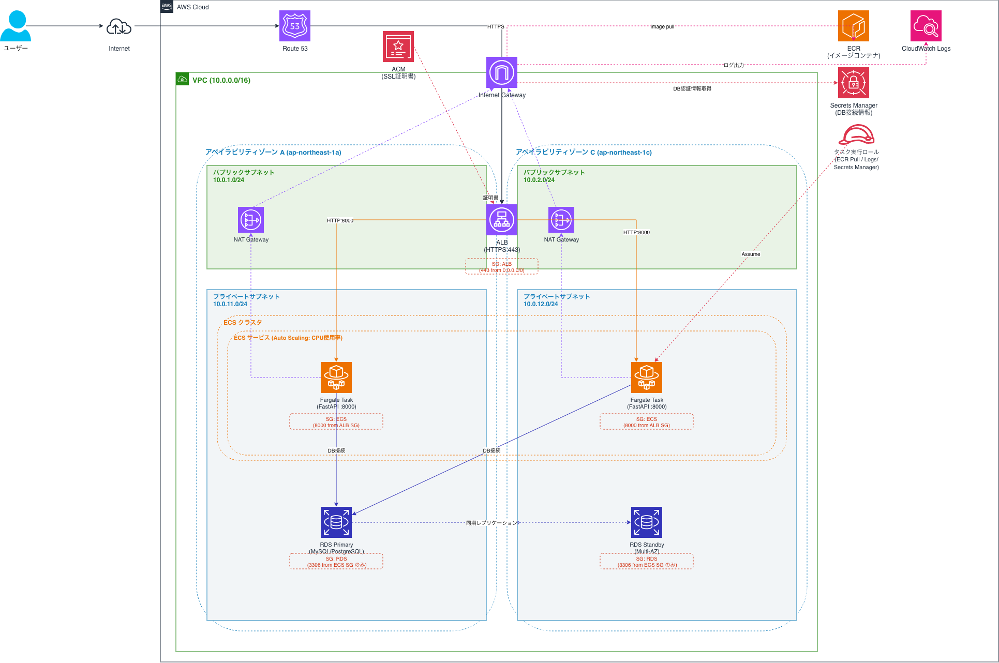

### AWS構成図



---

### Dockerfile/.dockerignore設計
予約管理システムのAPI
- マルチステージビルド
  - venvによる依存関係の隔離
    - 依存関係をvenv内に隔離することで、runtimeへ/opt/venvをコピーするだけで実行環境が構築できるようにする
    - COPY --from=builderで、どこをビルドステージからコピーすれば良いか明確になる
- USERの非ルート化
  - RCE(Remote Code Excution)の脆弱性がある際に、アプリケーション層(コンテナ環境)とホスト環境(コンテナを起動しているPC)での被害を限定する
  - EXPOSEでポート番号を1024未満を指定しない
    - 0から1023はLinuxの特権ポートなので、仮に80や443を使用すると権限エラーとなる
- PYTHONPATHの設定
  - Pythonのモージュール探索パスを設定
- .dockerignoreについて
  - Dockerfileは実行環境で不要
  - 開発環境の__pycache__は不要

---

### コンテナ起動方法
イメージビルド
```
cd src
docker build -t subject .
```

ボリュームの作成
```
docker volume create db-data
```

ネットワークの作成
```
docker network create subject-net
```

dbコンテナ起動
```
docker run -d --name db --network subject-net   -v db-data:/var/lib/mysql   -e MYSQL_ROOT_PASSWORD=rootpass   -e MYSQL_DATABASE=python_subject -p 3306:3306  mysql:latest
```

apiコンテ起動
```
docker run -d -p 8000:8000 --name subject --network subject-net     -e DB_HOST=db   -e DB_USER=root   -e DB_PASSWORD=rootpass   -e DB_NAME=python_subject   subject
```

---
